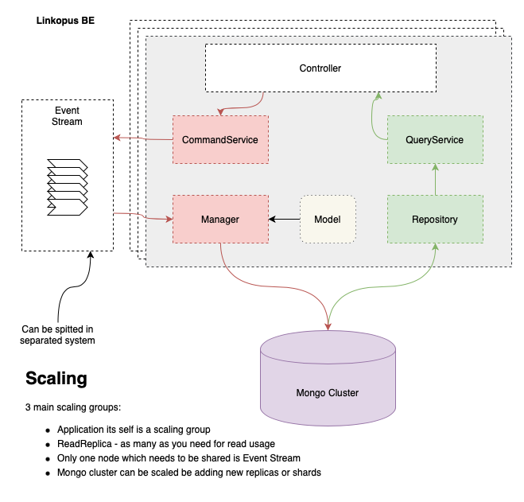

<br>

<h1 align="center">Linkopus</h1>

<p align="center">
  <a href="https://goreportcard.com/badge/github.com/lalabuy948/linkopus"></a>
  <a href="backend/go.mod"></a>
  <a href="/LICENCE"></a>
  <!-- <a href="https://typ.life/"></a> -->

</p>

<p align="center">
  The most over engineered link shortener.
</p>

<br><br>

### How to

dev
```sh
cd backend

go get

go run main.go

or

go build -tags emoji

./backend

cd frontend

npm install

npm run start
```

### BE Architecture overview

<p align="center">
    
</p>
